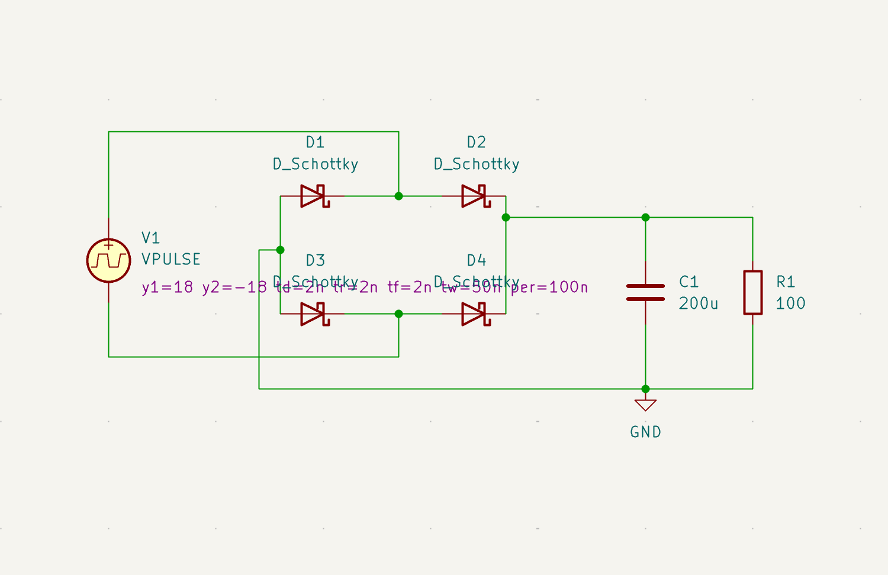

## Full-wave rectifier (track power tap)

Taps power directly from the Märklin digital track signal (~16–18V, digitally pulsed) to supply the locomotive's onboard electronics, removing the need for an onboard battery.

*Simulated in KiCad: 4-diode bridge (D1–D4), filter capacitor C1, load resistor R1.*

**Design:**
- Standard 4-diode full-wave bridge rectifier.
- Simulated with Schottky diode models; built and bench-tested with **1N4148** diodes.
- The two track rails connect to the bridge's two AC inputs — neither rail is "ground," the bridge's own DC− output corner is the actual ground reference for everything downstream.
- Filter capacitor (C1) smooths the output; a load resistor (R1) is required during testing to see realistic ripple/sag.

**Status:** Simulated and confirmed working on the physical bench prototype — stable DC output from the live track signal.
